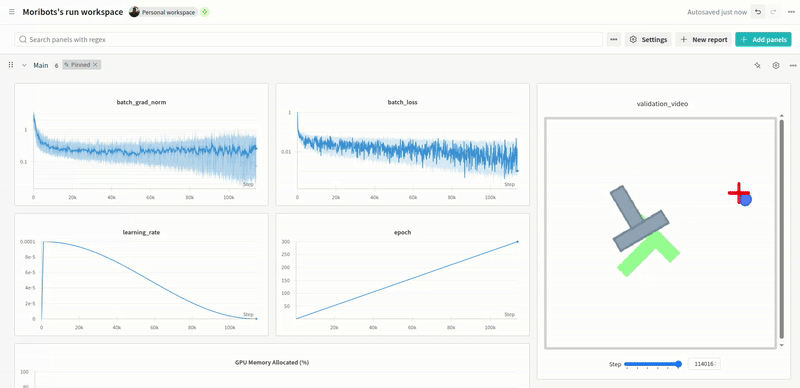

# Summary
This project is my independent foray into visuomotor policies, starting with diffusion, where I will solve toy problems from scratch. You should see:

- From-scratch implementations.
- Unit tested code.
- Production-grade training logs.
- Exportable into ready-to-use `.ipynb` format for cloud training.
- Toy problem extensions (e.g goal-guided policy, and/or 2D arm joint commands in place of EE targets).


[My notes on Visuomotor Diffusion Policies](Diffusion_Policy.pdf).

## Example Training/Validation Run

This is on the `Lerobot` dataset. I plan to do custom training at some point, but I started with a trustworthy dataset to validate my policy.



The most crucial part of this process was unit testing. My tests helped me ensure that my dataset and network were properly configured. To run:

```bash
python -m src.tests.unit_tests
```


## Installation

```bash
# Clone the repository
git clone https://github.com/moribots/2d-arm-diffusion.git
cd 2d-arm-diffusion

# Create a virtual environment
python -m venv venv

# Source your virtual environment.
source venv/bin/activate

# Install dependencies
pip install -e .
```

## Usage

### Producing cloud training notebook (currently formatted for Kaggle, but that's easy to change)

```bash
python -m src.notebooks.generate_notebook
```

### Training a diffusion policy

```bash
python -m src.diffusion.train_diffusion
```

### Running validation

```bash
python -m src.tests.test_validation
```

### Running the simulation environment

```bash
python -m src.simulation.simulation --mode collection --env custom
```

### Testing an existing policy

```bash
python -m src.simulation.simulation --mode inference --env lerobot
```

## Push Object Data Collection

This is my own implementation of [gym-pusht](https://github.com/huggingface/gym-pusht). My goal was to create a similar implementation with the added benefit of being able to generate my own training data, and to use different types of objects as well. If you want to modify the L into something else, you can just edit the polygon coordinates in `object.py`. I also hooked up an N-DOF arm to the data collection sim to make it a little more realistic. The arm cannot self-collide, but it can overlap the pushed object in 2D (I'm imagining it as being above the object in 3D, with the EE extending down to the plane of the object).

`config.py` lets you tune the contact dynamics to your liking.

### Data collection example


## Project Structure

```markdown
├── demo.gif
├── Diffusion.md
├── __init__.py
├── README.md
├── requirements.txt
├── setup.py
├── src
│   ├── config.py
│   ├── datasets
│   │   ├── __init__.py
│   │   └── policy_dataset.py
│   ├── diffusion
│   │   ├── diffusion_policy.py
│   │   ├── policy_inference.py
│   │   ├── train_diffusion.py
│   │   └── visual_encoder.py
│   ├── lerobot
│   │   └── training_data
│   ├── notebooks
│   │   └── generate_notebook.py
│   ├── seed.py
│   ├── simulation
│   │   ├── arm.py
│   │   ├── object.py
│   │   └── simulation.py
│   ├── tests
│   │   ├── test_validation.py
│   │   └── unit_tests.py
│   └── utils
│       ├── diffusion_utils.py
│       ├── normalize.py
│       ├── utils.py
│       ├── validation_utils.py
│       └── video_utils.py
```

To update, run `tree -I "venv|__pycache__|*.pyc" <path>`
## License

MIT License
